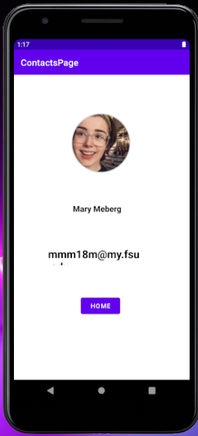

> **NOTE:** This README.md file should be placed at the **root of each of your repos directories.**
>
>Also, this file **must** use Markdown syntax, and provide project documentation as per below--otherwise, points **will** be deducted.
>

# LIS4331 Advanced Mobile Applications Development

## Bailey Weiss

### Assignment #1 Requirements:

*Four Parts:*

1. Distributed Version Control with Git amd Bitbucket
2. Development Installations
3. Chapter Questions (Chs 1, 2)
4. Bitbucket repos links: a)this assignment and b) the completed tutorials above (bitbucketstationlocations and myteamquotes).

#### README.md file should include the following items:

* Screenshot of running java Hello
* Screenshot of running Android Studio - My First App
* Screenshots of running Android Studio - Contacts App
* git commands w/short descriptions

> This is a blockquote.
> 
> This is the second paragraph in the blockquote.
>
> #### Git commands w/short descriptions:

1. git init: create new git repository
2. git status: shows the state of the working directory
3. git add: adds a change to the working directory
4. git commit: commit changes to repository
5. git push: send changes to the master branch of your remote repository
6. git pull: fetch content from remote repository
7. git clone: create a working copy of the local repository 

#### Assignment Screenshots:

*Screenshot of running java Hello*:

*Screenshot of Android Studio - My First App*:

*Screenshot of Android Studio - Contacts App*:

#### Tutorial Links:

*Bitbucket Tutorial - Station Locations:*
[A1 Bitbucket Station Locations Tutorial Link](https://bitbucket.org/BaileyWeiss5180/lis4331/commits/ "Bitbucket Station Locations")
