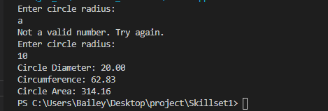
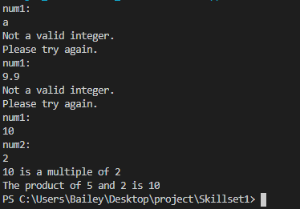
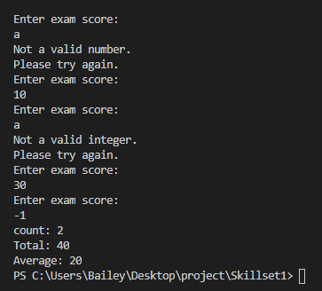

# LIS4331 Advanced Mobile Applications Development

## Bailey Weiss

### Assignment #2 Requirements:

#### README.md file should include the following items:
- Create Android App 
- Provide screenshots of Tip Calculator 
- Provide screenshots of Skill Set 1 
- Provide screenshots of Skill Set 2 
- Provide screenshots of Skill Set 3 

#### Skill Set 1:

#### Skill Set 2:

#### Skill Set 3:

#### Assignment Screenshots:

