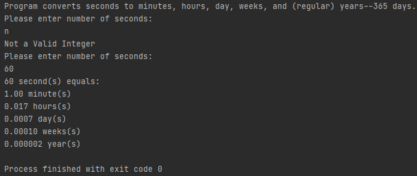

# LIS4331 Advanced Mobile Applications Development

## Bailey Weiss

### Assignment #3 Requirements:

#### README.md file should include the following items:
- Create Android App 
- Provide screenshots of Currency Converter 
- Provide screenshots of Skill Set 4 
- Provide screenshots of Skill Set 5 
- Provide screenshots of Skill Set 6 

#### Skill Set 4:

#### Skill Set 5:

#### Skill Set 6:

#### Assignment Screenshots:

