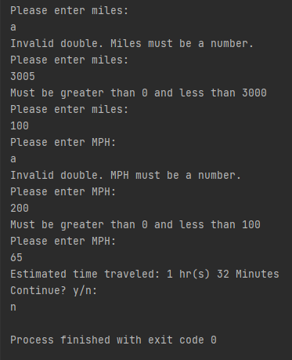

# LIS4331 Advanced Mobile Applications Development

## Bailey Weiss

### Assignment #4 Requirements:

#### README.md file should include the following items:
- Create Android App 
- Provide screenshots of Mortgage Calulator 
- Provide screenshots of Skill Set 10 
- Provide screenshots of Skill Set 11
- Provide screenshots of Skill Set 12

#### Skill Set 10:

#### Skill Set 11:

#### Skill Set 12:

#### Assignment Screenshots:

