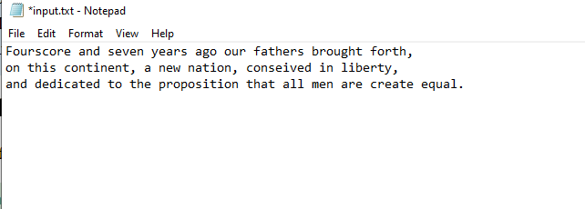
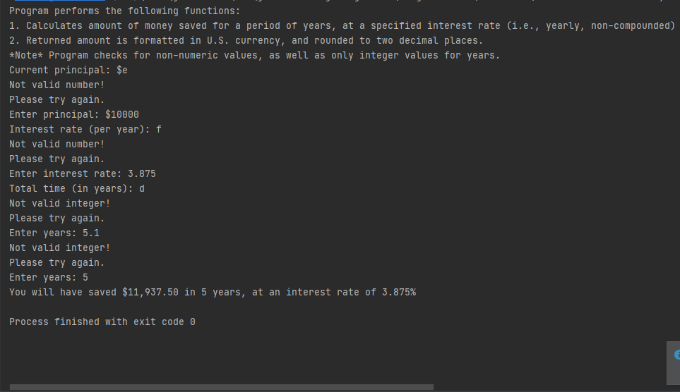
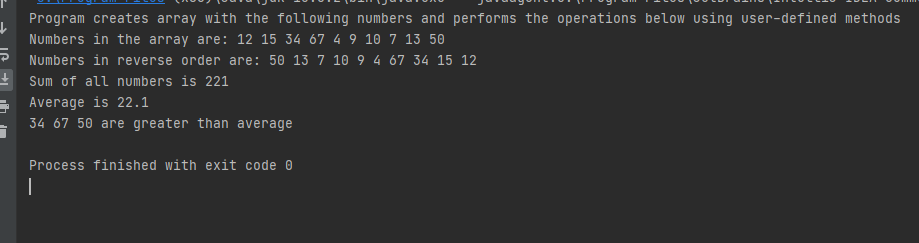
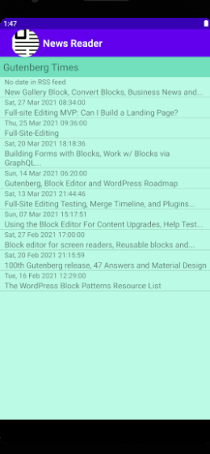

# LIS4331 Advanced Mobile Applications Development

## Bailey Weiss

### Assignment #5 Requirements:

#### README.md file should include the following items:
- Create Android App 
- Provide screenshots of Mortgage Calulator 
- Provide screenshots of Skill Set 13
- Provide screenshots of Skill Set 14
- Provide screenshots of Skill Set 15

#### Skill Set 13:

#### Skill Set 14:

#### Skill Set 15:

#### Assignment Screenshots:

