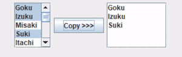

# LIS4331 Advanced Mobile Applications Development

## Bailey Weiss

### Project 1 Requirements:

#### README.md file should include the following items:
- Create Android App 
- Provide screenshots of Audio Player
- Provide screenshots of Skill Set 7 
- Provide screenshots of Skill Set 8 
- Provide screenshots of Skill Set 9 

#### Skill Set 7:

#### Skill Set 8:

#### Skill Set 9:

#### Assignment Screenshots:

