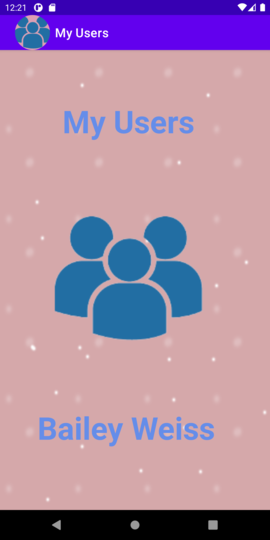
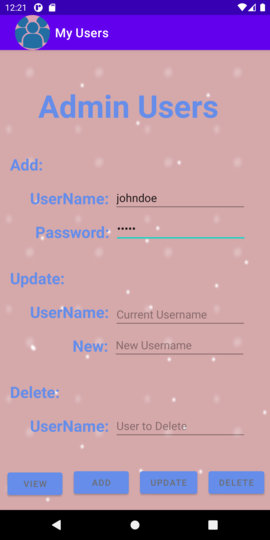
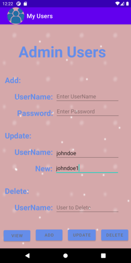
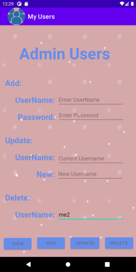
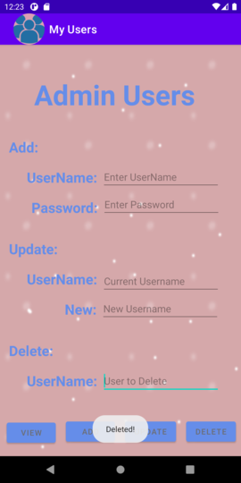
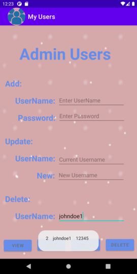
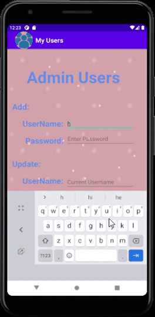

# LIS4331 Advanced Mobile Applications Development

## Bailey Weiss

### Project 2 Requirements:

#### README.md file should include the following items:
- Create Android App 
- Provide screenshots of My Users
- Provide Gif of application

#### Assignment Screenshots:

